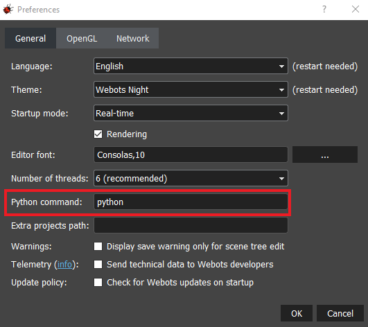
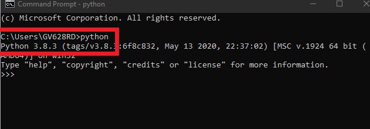
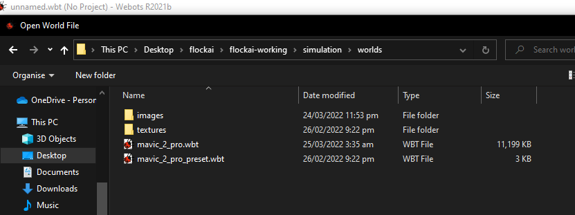
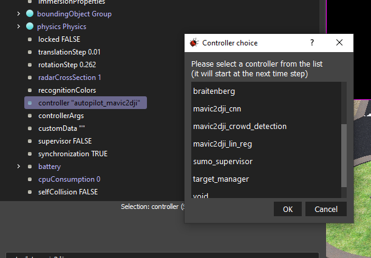

# Flockai for machine learning

## Integrating flockai with Webots

Since flockai is a framework built on top of Webots, it needs to be installed to the corresponding Webots controller' s directory.
The steps are described below:
#### 1. Checking installed python version
Upon launching Webots navigate to Tools->Preferences and identify the python command your Webots application uses to run controllers.

Then, launch a terminal (or command prompt) and type the same command to identify your default python version.

After the version is identified, the corresponding Webots controller directory needs to be noted down.
#### 2. Identifying Webots controller directory
Navigate to the directory that Webots was installed and copy the corresponding controller path to your clipboard.

Once the controller path is copied, flockai should be installed in to that directory

#### 3. Installing FlockAI to the Webots controller directory
Run the following command and make sure webots is installed in the destination directory

`pip install --no-cache-dir --upgrade --target="your/webots/controller/directory" flockai`

## Installing sample worlds, controllers and dependencies

#### 1. Installing flockai repo

Clone the flockai repo on your system

`git clone https://github.com/unic-ailab/flockai-working.git`

#### 2. Installing requirements

Navigate to the installed folder  and execute the following command to install python requirements

`pip install -r requirements.txt`

#### 3. Open one of the sample worlds located in the _simulation_ directory

In Webots, navigate to File->Open World... and load one of the sample worlds our team has developed

#### 4. Load sample controllers on your robots

Check the relevant documentation on each controller to make the appropriate changes on your world's objects

